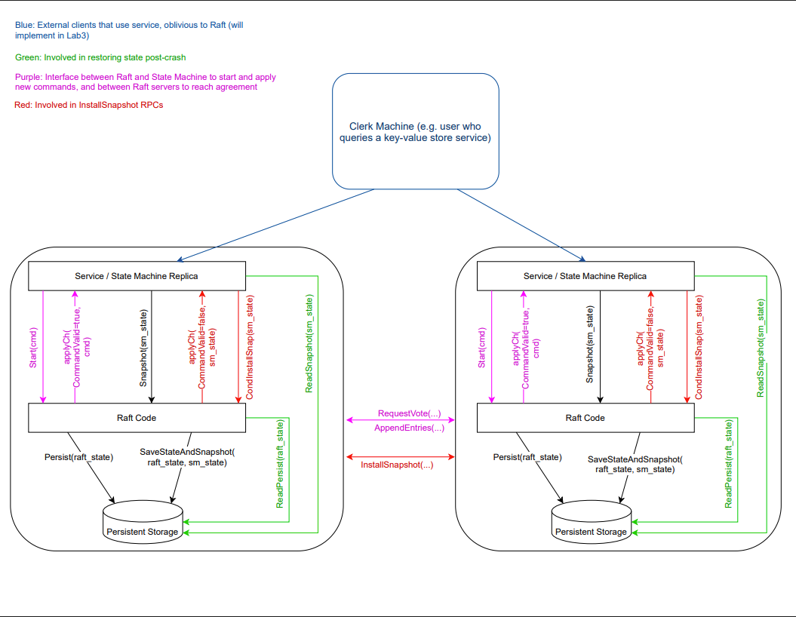

# RaftKV - A Sharded, Replicated Key-Value Store Build on Raft

## Overview
RaftKV is a distributed, sharded key-value store implemented on top of a robust [Raft consensus algorithm](http://nil.csail.mit.edu/6.5840/2024/papers/raft-extended.pdf). The system ensures **linearizability**, **exact-once semantics**, and **reliable operation under failures**.

This project is a standalone version of the distributed systems coursework developed for [MIT 6.5840 Distributed Systems](http://nil.csail.mit.edu/6.5840/2024/), and it has successfully passed the extensive test suite provided by the course.

## What is Raft?
[Raft](http://nil.csail.mit.edu/6.5840/2024/papers/raft-extended.pdf) is a consensus algorithm designed to manage a replicated log across distributed systems in a way that's easier to understand than Paxos. Raft is used to ensure that **multiple servers agree on the same sequence of operations**, enabling high availability and fault tolerance.

In this project, Raft is used to:
- Elect a leader to coordinate operations
- Replicate logs of client commands across multiple servers
- Ensure consistency across replicas even in the presence of server crashes
- Apply operations in a globally agreed order

>Note: This implementation does **not** support dynamic Raft cluster membership (Section 6 of the Raft paper), as the MIT 6.5840 labs explicitly exclude it.

## Architecture
The system consists of:
- **Raft Core**: A replicated log system that supports leader election, log replication, and snapshotting.
- **Shard Controller**: A centralized controller (also implemented using Raft) that manages assignment of shards to replica groups.
- **ShardKV**: A fault-tolerant key-value store, serving disjoint subsets (shards) of the key space.

Raft interactions can be visualized in the following diagram:


### Sharding and Reconfiguration
- The key space is divided into fixed shards (e.g., 10 shards), assigned to groups evenly to balance load.
- Configuration changes (e.g., groups joining/leaving) trigger reassignment of shards.
- During reconfiguration, shards are migrated via RPC between old and new owners.
- Servers apply reconfiguration operations and client requests via Raft logs to guarantee consistent ordering and linearizability.
- Servers reject requests for shards they no longer own, enabling safe and transparent client retries.

### Features
- **Falt Tolerance**: Uses Raft consensus for both shard controller and replica groups to survive failures of minority of servers.
- **Linearizability**: Client operations observe a consistent order despite reconfiguration and shard migration.
- **At-Most-Once RPC Semantics**: Duplicate client requests are handled gracefully, ensuring that operations are applied at most once.
- **Dynamic Reconfiguration**: The system can adapt to changes in the number of groups and shards, allowing for scaling and load balancing.
- **Shard Migration**: Efficient transfer of shard state during configuration changes ensures minimal disruption.

## Test Coverage
The implementation has passed all tests from the **MIT 6.5840** testing suite, which simulates unreliable networks, crashes, and reconfiguration. Those tests include:
- **Raft consensus**: leader election, log replication, persistence, recovery from crashes, snapshots, and network partitions.
- **Key/value server**: correct operation under concurrent clients, network unreliability, restarts, partitions, and snapshotting.
- **Shard controller**: dynamic group membership, shard assignment, joins/leaves, concurrent membership changes, and minimal shard movement.
- **Sharded key/value store**: correct shard ownership, rejection of out-of-shard requests, shard migration during reconfiguration, snapshotting, and handling unreliable networks and crashes.
- **Challenge tests**: efficient shard data deletion after migration, serving client requests for unaffected shards during reconfiguration, and partial shard serving before full config completion.

## How to Run
### Prerequisites
- [Docker](link)
- [Docker Compose](link)
### Build and Launch
```bash
docker-compose up --build
```
This will spin up:
- A sharded key-value store with two groups, each containing three replicas.
- A shard controller, replicated across three nodes.
- Command-line clients to interact with the system.
### Use the CLI Clients
#### Shardctrler Client
```bash
docker exec -it shardctrler-client /app/shardctrler-client --ctrl-peers=shardctrler-0:8000,shardctrler-1:8000,shardctrler-2:8000
```
Supported commands:
```mathematica
Join gid:addr1,addr2 ...
Leave gid1,gid2,...
Move shard gid
Query [num]
```
Example:
```bash
> Join 1:shardkv1-0:8000,shardkv1-1:8000,shardkv1-2:8000

OK
> > Query
Config #0: {Num:0 Shards:[0 0 0 0 0 0 0 0 0 0] Groups:map[]}
> Query
Config #1: {Num:1 Shards:[1 1 1 1 1 1 1 1 1 1] Groups:map[1:[shardkv1-0:8000 shardkv1-1:8000 shardkv1-2:8000]]}
> Join 2:shardkv2-0:8000,shardkv2-1:8000,shardkv2-2:8000
OK
> Query
Config #2: {Num:2 Shards:[2 2 2 2 2 1 1 1 1 1] Groups:map[1:[shardkv1-0:8000 shardkv1-1:8000 shardkv1-2:8000] 2:[shardkv2-0:8000 shardkv2-1:8000 shardkv2-2:8000]]}
> Leave 1
OK
```
#### ShardKV Client
```bash
docker exec -it shardkv-client /app/shardkv_client --ctrl-peers=shardctrler-0:8000,shardctrler-1:8000,shardctrler-2:8000
```
Supported commands:
```mathematica
Put key value
Get key
Append key suffix
```

## Project Structure
```plaintext
.
├── raft/               # Raft implementation
├── shardctrler/        # Shard controller for dynamic config
├── shardkv/            # Sharded KV store logic
├── kvutil/             # RPC abstractions and logging
├── launcher/           # Entrypoints for services and CLI tools
├── Dockerfile          # Multi-binary build container
├── docker-compose.yml  # Launch configuration
└── README.md           # This file
```

## License
This project is licensed under the MIT License. See the [LICENSE](LICENSE) file for details.
